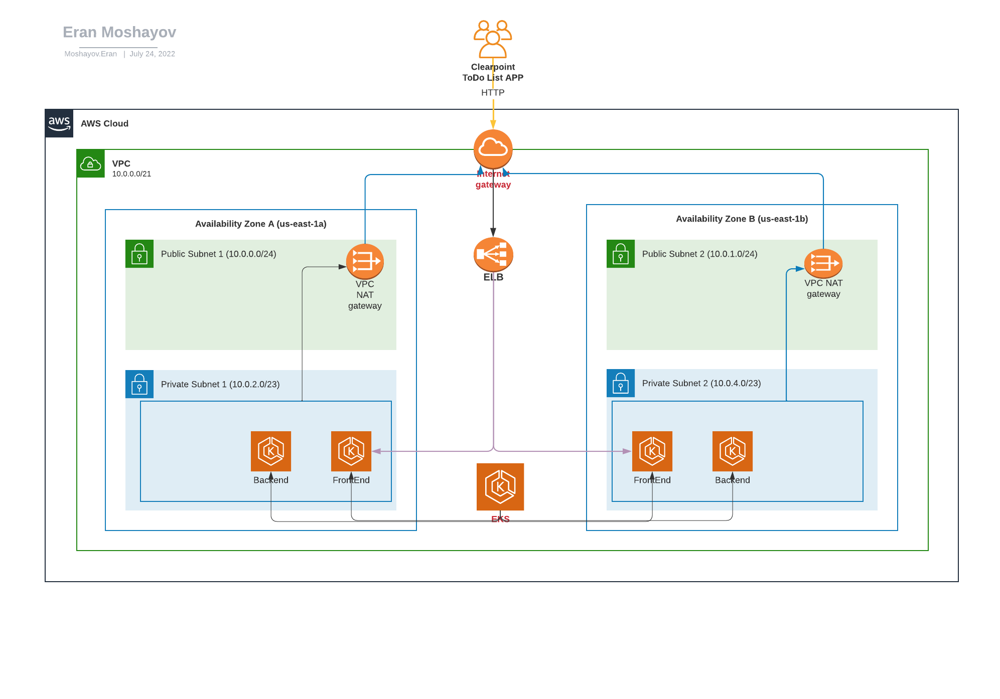
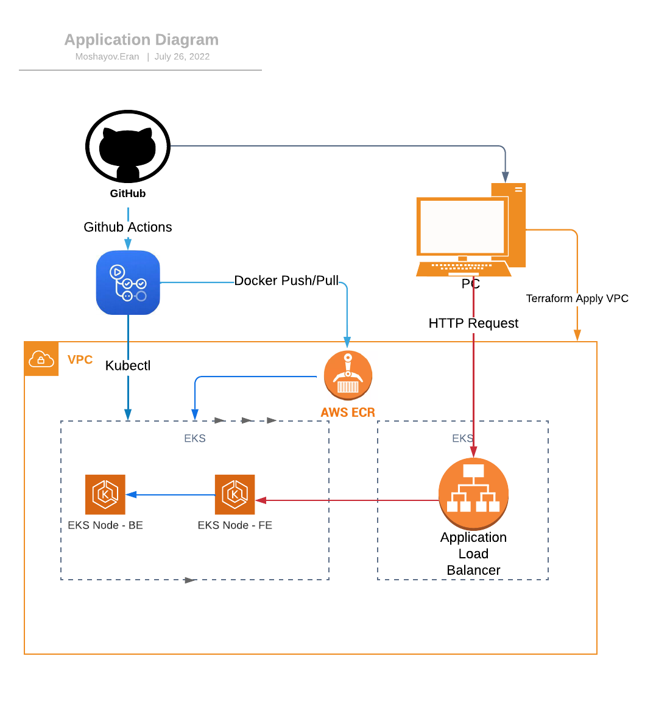
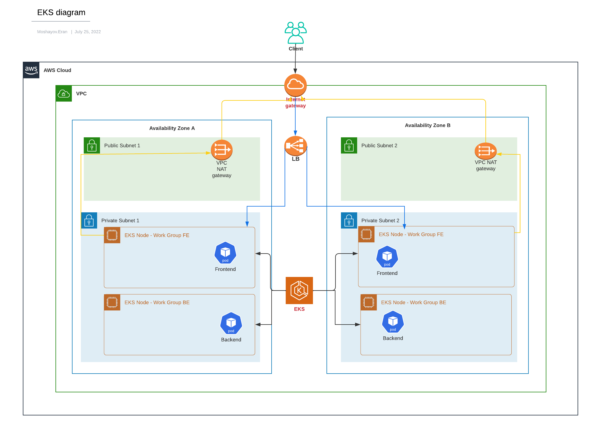

<h1 align="center">Clearpoint SRE Assessment</h1>
<h6 align="center">This Repo will aggregate my assessment</h6>

<p align="center"></p>

## Table of Contents

- [Infrastructure Architecture Diagram](#Infrastructure-Architecture-Diagram)
- [Application Diagram](#Application-Diagram)
- [EKS Diagram](#EKS-Diagram)
- [IP Address Allocation](/network_address_design/network_adresses_design.md)
- [Deployment Process](#Deployment-Process)
- [Prerequisites](#prerequisites)
- [Deployment Instructions](#Deployment-Instructions)
- [Application Connections](#Application-Connections)
- [Application URLS](#Application-URLS)
- [Vulnerability Check](#Vulnerability-Check)
- [Monitoring](#Monitoring)
- [Kandula](#Kandula)
- [Links to dockerhub related images](#Links-to-dockerhub-related-images)
- [Links to GitHub related repository](#Links-to-GitHub-related-repository)
- [Improvement Points For The Future](#Improvement-points-for-the-future)


## Infrastructure Architecture Diagram


## Application Diagram


## EKS Diagram


## Deployment Process
+ Infrastructure deployment via Terraform
+ EKS deployments via Github actions

## Prerequisites

### Applications and tools
To deploy all infrastructure you will need below application to be installed on your workstation/server
+ Install [GIT](https://github.com/git-guides/install-git) on your workstation/server
+ Install [Terraform v1.2.5](https://learn.hashicorp.com/tutorials/terraform/install-cli) on your workstation/server
+ Install [aws cli](https://docs.aws.amazon.com/cli/latest/userguide/install-cliv2.html) on your workstation/server
+ Install [kubectl](https://kubernetes.io/docs/tasks/tools/install-kubectl/) on your workstation/server

### AWS User and tokens
+ Access to your Console AWS and create a user for terraform deployment with right permissions [Link](https://docs.aws.amazon.com/IAM/latest/UserGuide/id_users_create.html) and save it for later
+ Access to your Console AWS and create a user for Github action deployments with right permissions [Link](https://docs.aws.amazon.com/IAM/latest/UserGuide/id_users_create.html) and save it for later

### AWS Cli configurations
+ Configure your [AWS Cli](https://docs.aws.amazon.com/cli/latest/userguide/cli-configure-profiles.html) 

### DockerHub Token
+ Create your [DockerHub Access Tokens](https://docs.docker.com/docker-hub/access-tokens/) and save it for later

### Github configurations
+ Clone Project [GITHUB](https://github.com/eranmos/clearpoint-sre-assessment-tmp.git)
+ Create [Personal access tokens](https://docs.github.com/en/enterprise-server@3.4/authentication/keeping-your-account-and-data-secure/creating-a-personal-access-token) on Github and save it for later
+ Create [Github Actions secrets](https://docs.github.com/en/actions/security-guides/encrypted-secrets) on the clone repo as below:
#### DOCKERHUB_TOKEN
#### DOCKERHUB_USERNAME
#### TERRAFORM_AWS_ACCESS_KEY_ID
#### TRERRAFORM_AWS_SECRET_ACCESS_KEY

## Deployment Instructions
Infrastructure deployment will be performed via Terraform locally or Github actions.
1. Terraform deployment is divided into eight parts.
   Run the following on each terraform_XXX folder (Jenkins job can run only after Jenkins deployment)
   ```bash
   terraform init
   terraform apply --auto-approve
   ```

+ [Terraform-s3](/terraform/terraform_s3_bucket) - Creating S3 Buckets
+ [Terraform-EBS](/terraform/terraform_ebs_jenkins) - Creating EBS Storage
+ [Terraform-VPC](/terraform/terraform_vpc) - Creating VPC
+ [Terraform-Jenkins](/terraform/terraform_jenkins) - Creating Jenkins Master & Jenkins Slave
+ [Terraform-Servers](/terraform/terraform_servers) - Creating Consul cluster, Elasticsearch, Prometheus without application (application will be installed via ansible playbook)
+ [Terraform-EKS](/terraform/terraform_eks) - Creating Kubernetes cluster
+ [Terraform-RDS](/terraform/terraform_postgres) - Creating Postgres DB on AWS RDS
+ [Terraform Bastion Server](/terraform/terraform_bastion_server) - Creating Bastion server for debugging & maintenance
> note: Bastion server - In order to avoid security issues we're recommending to destroy the machine or turn it off when not needed

After deploying Jenkins Servers (Master & Slave) you can run rest of the deployments via Jenkins Job:
Jenkins UI : https://jenkins.kandula.click/
+ [jenkins file location](/Jenkins/jenkins_jobs/jenkis_terraform_deployments/jenkins_terraform_build_kandula_env.groovy)
+ [jenkins job link](https://jenkins.kandula.click/view/Terraform%20Deployment/job/Terraform-Build-Kandula-Env/)


2. After deploying the infrastructure via Terraform & Jenkins we will need to provision our EC2 instances with below app:
+ Consul Cluster (3 servers)
+ Consul Agent
+ Consul Registrator
+ Elasticsearch
+ Kibana
+ Logstash
+ Filebeat
+ Prometheus
+ Node Exporter

All Ansible playbooks will be run via jenkins job (Ansible installed on the Jenkins-slave docker image).

+ please run Jenkins job:
+ [jenkins file location](/Jenkins/jenkins_jobs/jenkins_ansible_playbooks/jenkins_ansible_build_kandula.groovy)
+ [jenkins job link](https://jenkins.kandula.click/view/Ansible-Playbooks/job/ansible-playbook-all-apps/)


4. Deploying below applications on EKS cluster:
+ Kandula-Prometheus-Stack
+ Kandula App
+ Filebeat
  All EKS deployments will be run via Jenkins Job
    + please run Jenkins Job:
    + [jenkins file location](Jenkins/jenkins_jobs/kubernetes_deployment/jenkins_kube_all_deployment.groovy)
    + [jenkins job link](https://jenkins.kandula.click/view/Kubernetes%20Deployment/job/Kandula-Deployment-All-EKS/)

#### [Click here get all info about my jenkins jobs and configurations](Jenkins/README.md)

## Application Connections

### Clearpoint FE BE & LB:
| Description | Source | Source Port | Destination  | Destination Port | Protocol |
| ----------- | ------ | ----------- | ------------ | -----------------| -------- |
| Frontend | * | * | Backend | 80 | HTTP |
| HTTP to ELB from Internet | * | *  | ELB | 80 | TCP |
| SSH | * | * | bastion | 22 | TCP |

## Application URLS
To access applications I created two AWS hostedzones:
1. Internal communication
   

2. External communication
   
>note: records on route53 created via terraform deployment

Public URLs to access my apps: <br />
- [Kandula](https://app.kandula.click/) - Kandula web application
- [Consul](https://consul.kandula.click/) - Consul UI
- [Elasticsearch](https://es.kandula.click/) - DB to store logs
- [Kibana](https://kibana.kandula.click/) - Kibana data visualization
- [Prometheus EKS](https://prometheus.kandula.click/) -  Prometheus that monitoring EKS Cluster
- [Prometheus EC2](https://prometheus-ec2.kandula.click/) - Prometheus that monitoring EC2 instances that not related to EKS
- [Grafana](https://grafana.kandula.click/) - Grafana visualization (working with both Prometheus servers)
- [Kibana](https://jenkins.kandula.click/) - Jenkins UI

## Vulnerability Check
In my Project I am using two vulnerability tools:
+ Trivy
+ Snyk

### Docker image Vulnerability Check via Trivy
I integrated Trivy in my Jenkins pipeline.
When jenkins will create a docker trivy will scan it & will provide output report
with vulnerability issues that he discovered

#### Jenkins - Docker image creation pipeline with Trivy:


#### Trivy report on jenkins pipeline:


### Code scan vulnerability Check via Trivy & Snyk
For the code scan I used two tools Trivy & Snyk.
I integrated Trivy with my github & created workflow to scan my code when pull request created
and will failed the build when discovered critical issues.


As I wanted to discover more tools I started to use Snyk & Integrated it with my GitHub as well:


## Monitoring


My monitoring sulition is devided for two parts :
1. Metric monitoring
   I am using below components for metric monitoring
+ Prometheus
+ Grafana
+ Node Exporter

#### Grafana NodeExporter dashboards for EC2 Instance


#### Grafana


#### Grafana


2. Loging Monitoring
   I am using below components for metric monitoring
+ Elasticsearch
+ Kibana
+ Logstash
+ Filebeat

#### Kibana ALB dashboards


#### EKS dashboards


#### Kandula
##### Kandula web site


### Links to dockerhub related images
- [Kandula](https://hub.docker.com/repository/docker/erandocker/ops-school-kandula) - docker pull erandocker/ops-school-kandula:tagname
- [Jenkins Slave Ubuntu-18.04](https://hub.docker.com/repository/docker/erandocker/jenkins-slave-ubuntu-18.4) - docker pull erandocker/jenkins-slave-ubuntu-18.4:tagname
- [Jenkins Slave Centos-7](https://hub.docker.com/repository/docker/erandocker/jenkins-slave-docker-centos-7) - docker pull erandocker/jenkins-slave-docker-centos-7:tagname

### Links to GitHub related repository
- [Terrafom VPC module](https://github.com/eranmos/ops-school-terraform-aws-vpc.git) - Terraform VPC module for AWS VPC, Subnets, Routing, NAT Gateway creation
- [Kandula Application](https://github.com/eranmos/ops-school-kandula-project-app.git) - Code for Kandule Application

### Improvement Points For The Future
+ Creating helm chart for kandula app & filebeat.
+ Improving my Grafana & Kibana dashboards.
+ Supporting the DB connection to application.
+ Adding more logs to Kandula application.
+ Creating Alertmanager & integrate it with slack to send msg for Critical issues.
+ using [Jenkins Fleet Plugin](https://plugins.jenkins.io/ec2-fleet/) to deploy Jenkins Slaves

