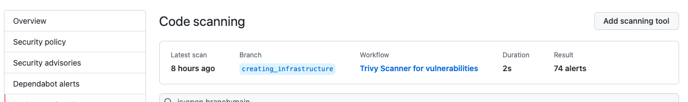

<h1 align="center">Clearpoint SRE Assessment</h1>
<h6 align="center">This Repo will aggregate my assessment</h6>

<p align="center"></p>

## Table of Contents

- [Infrastructure Architecture Diagram](#Infrastructure-Architecture-Diagram)
- [Application Diagram](#Application-Diagram)
- [EKS Diagram](#EKS-Diagram)
- [IP Address Allocation](/network_address_design/network_adresses_design.md)
- [Deployment Process](#Deployment-Process)
- [Prerequisites](#prerequisites)
- [Deployment Instructions](#Deployment-Instructions)
- [Application Connections](#Application-Connections)
- [Application URLS](#Application-URLS)
- [Vulnerability Check](#Vulnerability-Check)
- [Clearpoint-Todo List App](#Clearpoint-Todo-List-App)
- [Links to dockerhub related images](#Links-to-dockerhub-related-images)
- [Improvement Points For The Future](#Improvement-points-for-the-future)


## Infrastructure Architecture Diagram


## Application Diagram


## EKS Diagram


## Deployment Process
+ Infrastructure deployment via Terraform
+ applications deployments via Github actions

## Prerequisites

### Applications and tools
To deploy all infrastructure you will need below application to be installed on your workstation/server
+ Install [GIT](https://github.com/git-guides/install-git) on your workstation/server
+ Install [Terraform v1.2.5](https://learn.hashicorp.com/tutorials/terraform/install-cli) on your workstation/server
+ Install [aws cli](https://docs.aws.amazon.com/cli/latest/userguide/install-cliv2.html) on your workstation/server
+ Install [kubectl](https://kubernetes.io/docs/tasks/tools/install-kubectl/) on your workstation/server

### AWS User and tokens
+ Access to your Console AWS and [create a user](https://docs.aws.amazon.com/IAM/latest/UserGuide/id_users_create.html) for terraform deployment with the right permissions. Save it for later
+ Access to your Console AWS and [create a user](https://docs.aws.amazon.com/IAM/latest/UserGuide/id_users_create.html) for Github action deployments with the right permissions. Save it for later

### AWS Cli configurations
+ Configure your [AWS Cli](https://docs.aws.amazon.com/cli/latest/userguide/cli-configure-profiles.html) 

### Github configurations
+ Clone [GITHUB](https://github.com/eranmos/clearpoint-sre-assessment-tmp.git) Project
+ Create [Personal access tokens](https://docs.github.com/en/enterprise-server@3.4/authentication/keeping-your-account-and-data-secure/creating-a-personal-access-token) on Github and save it for later
+ Create [Github Actions secrets](https://docs.github.com/en/actions/security-guides/encrypted-secrets) as below and add your data:
##### AWS_ACCESS_KEY_ID
##### AWS_SECRET_ACCESS_KEY
##### AWS_DEFAULT_REGION
##### KUBE_CONFIG_DATA

+ Enable [Github code scanning](https://docs.github.com/en/code-security/code-scanning/automatically-scanning-your-code-for-vulnerabilities-and-errors/setting-up-code-scanning-for-a-repository) for a repository
+ 
<br />

```
.
├── ./Backend
├── ./EKS_deployments_yaml
├── ./Frontend
├── ./diagrams_&_pictures
├── ./network_address_design
└── ./terraform
```
## Deployment Instructions
Infrastructure deployment will be performed via Terraform locally
1. Terraform deployment is divided into eight parts.
   Run the following on each terraform_XXX folder (Jenkins job can run only after Jenkins deployment)
   ```bash
   terraform init
   terraform apply --auto-approve
   ```

+ [Terraform-s3](/terraform/terraform_s3_bucket) - Creating S3 Buckets
+ [Terraform-EBS](/terraform/terraform_ebs_jenkins) - Creating EBS Storage
+ [Terraform-VPC](/terraform/terraform_vpc) - Creating VPC
+ [Terraform-Jenkins](/terraform/terraform_jenkins) - Creating Jenkins Master & Jenkins Slave
+ [Terraform-Servers](/terraform/terraform_servers) - Creating Consul cluster, Elasticsearch, Prometheus without application (application will be installed via ansible playbook)
+ [Terraform-EKS](/terraform/terraform_eks) - Creating Kubernetes cluster
+ [Terraform-RDS](/terraform/terraform_postgres) - Creating Postgres DB on AWS RDS
+ [Terraform Bastion Server](/terraform/terraform_bastion_server) - Creating Bastion server for debugging & maintenance
> note: Bastion server - In order to avoid security issues we're recommending to destroy the machine or turn it off when not needed

After deploying Jenkins Servers (Master & Slave) you can run rest of the deployments via Jenkins Job:
Jenkins UI : https://jenkins.kandula.click/
+ [jenkins file location](/Jenkins/jenkins_jobs/jenkis_terraform_deployments/jenkins_terraform_build_kandula_env.groovy)
+ [jenkins job link](https://jenkins.kandula.click/view/Terraform%20Deployment/job/Terraform-Build-Kandula-Env/)


2. After deploying the infrastructure via Terraform & Jenkins we will need to provision our EC2 instances with below app:
+ Consul Cluster (3 servers)
+ Consul Agent
+ Consul Registrator
+ Elasticsearch
+ Kibana
+ Logstash
+ Filebeat
+ Prometheus
+ Node Exporter

4. Deploying below applications on EKS cluster:
+ Kandula-Prometheus-Stack
+ Kandula App
+ Filebeat
  All EKS deployments will be run via Jenkins Job
    + please run Jenkins Job:
    + [jenkins file location](Jenkins/jenkins_jobs/kubernetes_deployment/jenkins_kube_all_deployment.groovy)
    + [jenkins job link](https://jenkins.kandula.click/view/Kubernetes%20Deployment/job/Kandula-Deployment-All-EKS/)

#### [Click here get all info about my jenkins jobs and configurations](Jenkins/README.md)

## Application Connections

### Clearpoint FE BE & LB:
| Description | Source | Source Port | Destination  | Destination Port | Protocol |
| ----------- | ------ | ----------- | ------------ | -----------------| -------- |
| Frontend | * | * | Backend | 80 | HTTP |
| HTTP to ELB from Internet | * | *  | ELB | 80 | TCP |
| SSH | * | * | bastion | 22 | TCP |

## Application URLS
To access applications I created two AWS hostedzones:


## Vulnerability Check
In this Project I am using Trivy vulnerability tool

### Docker image Vulnerability Check via Trivy
I integrated Trivy in my GitHub Actions pipeline.
When we have Git push or pull requests to related Frontend, Backend, folders and files on "main" branch Github Actions will be trigger.
Pipeline will create:
+ Docker image 
+ Docker image vulnerability check(with report) 
+ Upload Docker image to docker hub if we dont have Critial vulnerability issue.

#### Github Actions - Trivy report for Docker image Vulnerability :


### Code scan vulnerability Check via Trivy
For the code scan I used Trivy as well.
I integrated Trivy with Github Actions & created workflow to scan my code when push and pull request created.
Will failed the build when discovered critical vulnerability issues.




## Clearpoint-Todo List App


### Improvement Points For The Future
+ Creating helm chart for Backend and Frontend app.
+ Creating Metric monitoring with Prometheus, Node Exporter and Grafana ...
+ Creating Loging Monitoring with Elasticsearch, Kibana, Logstash, Filebeat ...
+ Creating Alertmanager & integrate it with slack to send msg for Critical problems.


