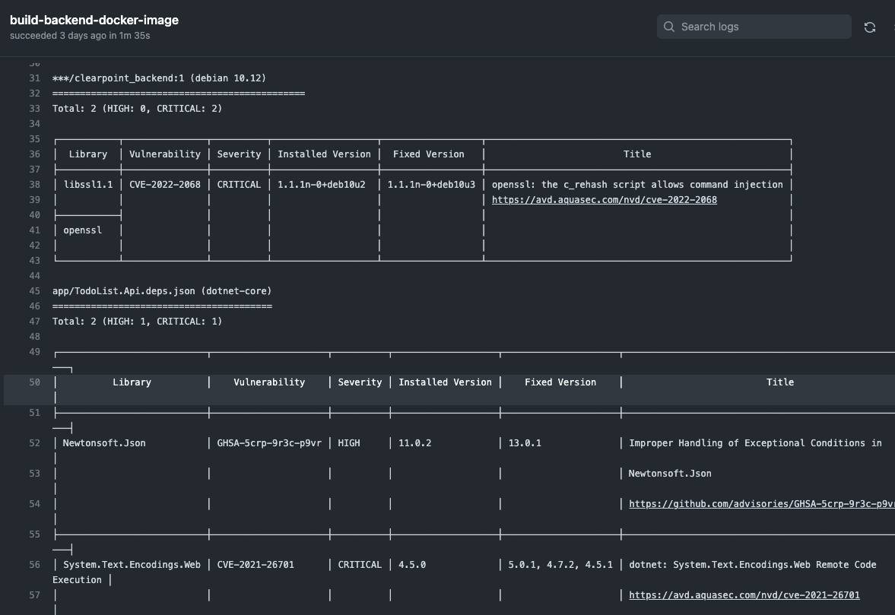

<h1 align="center">Clearpoint SRE Assessment</h1>
<h6 align="center">This Repo will aggregate my assessment</h6>

<p align="center"></p>

## Table of Contents

- [Infrastructure Architecture Diagram](#Infrastructure-Architecture-Diagram)
- [Application Diagram](#Application-Diagram)
- [EKS Diagram](#EKS-Diagram)
- [IP Address Allocation](/network_address_design/network_adresses_design.md)
- [Deployment Process](#Deployment-Process)
- [Prerequisites](#prerequisites)
- [Repository Folder structure](#Repository-Folder-structure)
- [Deployment Instructions](#Deployment-Instructions)
- [Application URL](#Application-URL)
- [Application Connections](#Application-Connections)
- [Vulnerability Check](#Vulnerability-Check)
- [Clearpoint-Todo List App](#Clearpoint-Todo-List-App)
- [Links to dockerhub related images](#Links-to-dockerhub-related-images)
- [Improvement Points For The Future](#Improvement-points-for-the-future)


## Infrastructure Architecture Diagram


## Application Diagram


## EKS Diagram


## Deployment Process
+ Infrastructure deployment via Terraform
+ applications deployments via Github actions

## Prerequisites

### Applications and tools
To deploy all infrastructure you will need below application to be installed on your workstation/server
+ Install [GIT](https://github.com/git-guides/install-git) on your workstation/server
+ Install [Terraform v1.2.5](https://learn.hashicorp.com/tutorials/terraform/install-cli) on your workstation/server
+ Install [aws cli](https://docs.aws.amazon.com/cli/latest/userguide/install-cliv2.html) on your workstation/server
+ Install [kubectl](https://kubernetes.io/docs/tasks/tools/install-kubectl/) on your workstation/server

### AWS User and tokens
+ Access to your Console AWS and [create a user](https://docs.aws.amazon.com/IAM/latest/UserGuide/id_users_create.html) for terraform deployment with the right permissions. Save it for later
+ Access to your Console AWS and [create a user](https://docs.aws.amazon.com/IAM/latest/UserGuide/id_users_create.html) for Github action deployments with the right permissions. Save it for later

### AWS Cli configurations
+ Configure your [AWS Cli](https://docs.aws.amazon.com/cli/latest/userguide/cli-configure-profiles.html) 

### Github configurations
+ Create [Personal access tokens](https://docs.github.com/en/enterprise-server@3.4/authentication/keeping-your-account-and-data-secure/creating-a-personal-access-token) on Github and save it for later
+ Create [Github Actions secrets](https://docs.github.com/en/actions/security-guides/encrypted-secrets) as below and add your data:

```##### AWS_ACCESS_KEY_ID
##### AWS_SECRET_ACCESS_KEY
##### AWS_DEFAULT_REGION
##### KUBE_CONFIG_DATA
```
+ Enable [Github code scanning](https://docs.github.com/en/code-security/code-scanning/automatically-scanning-your-code-for-vulnerabilities-and-errors/setting-up-code-scanning-for-a-repository) for a repository

<br />

## Repository Folder structure

```
.
├
├── ./.github
│   └── ./.github/workflows
├── ./Backend
├── ./EKS_deployments_yaml
├── ./Frontend
├── ./diagrams_&_pictures
├── ./network_address_design
└── ./terraform
```
+ /.github/workflows - All the CD pipelines for github actions <br />
+ /Backend - Backend application folder and docker file <br />
+ /EKS_deployments_yaml - All EKS deployments files(manifests) <br />
+ /Frontend - Frontend application folder and docker file <br />
+ /diagrams_&_pictures - All print screens for readme.md files <br />
+ network_address_design - Network address allocation for this project <br />
+ /terraform - terraform files for infrastructure deployment on AWS <br />

## Deployment Instructions
Infrastructure deployment will be performed via Terraform locally
1. Clone [GITHUB](https://github.com/eranmos/clearpoint-sre-assessment-tmp.git) Project to your desktop <br /> <br />

3. Access to terraform folder and run below commands

   ```bash
   terraform init
   terraform plan
   terraform apply --auto-approve
   ```

Terraform will create all the resources for this Project  <br /><br />

3. When EKS cluster is ready you will need to update github secrets with KUBECONFIG file <br />

```bash
cat $HOME/.kube/config | base64
```
copy the result and them to github secrets that you already created
```
##### KUBE_CONFIG_DATA
``` 
<br />
4. In this step you will need to update the docker image repository location by copy then from the terraform output

```
Backend_repository_URL = "XXXXXXXXX.dkr.ecr.us-east-1.amazonaws.com/clearpoint-frontend"
Frontend_repository_URL = "XXXXXXXXX.dkr.ecr.us-east-1.amazonaws.com/clearpoint-backend"
```
please update backend url in the backend deployment yaml:

```
├── ./EKS_deployments_yaml
│    ├── ./EKS_deployments_yaml/backend-deployment.yaml
```

```
containers:
  - name: clearpoint-backend
    image: "XXXXXXXXX.dkr.ecr.us-east-1.amazonaws.com/clearpoint-backend:latest"
```

Please update frontend url in the frontend deployment yaml:

```
├── ./EKS_deployments_yaml
    ├── ./EKS_deployments_yaml/frontend-deployment.yaml
```

```
containers:
  - name: clearpoint-frontend
    image: "XXXXXXXXX.dkr.ecr.us-east-1.amazonaws.com/clearpoint-frontend:latest"
```
<br />
5. Push your changes to main github branch will trigger github Action that will create docker image & will upload it to ecr repository <br />
You can find related workflow on below location:

```
├── ./.github
    └── ./.github/workflows
        ├── ./.github/workflows/docker-image-backend-aws.yml
        ├── ./.github/workflows/docker-image-frontend-aws.yml

```

When pipeline succeeded you can verify in ECR that you can see the docker image & tags for backend & frontend <br />

6. To deploy Backend, Backend service, Frontend and frontend service on EKS cluster you will need to trigger manually the CD pipeline. <br />
   You can find related workflow on below location:

```
── ./.github
│  ├── ./.github/.DS_Store
│  └── ./.github/workflows
│      ├── ./.github/workflows/AWS-EKS-Deployment-Environment.yml
```
<br />


## Application URL

To find Application URL please go to github action logs & find below step after frontend-service deployment


#### [Click here get all info about my jenkins jobs and configurations](Jenkins/README.md)

## Application Connections

### Clearpoint FE BE & LB:
| Description | Source | Source Port | Destination  | Destination Port | Protocol |
| ----------- | ------ | ----------- | ------------ | -----------------| -------- |
| Frontend | * | * | Backend | 80 | HTTP |
| HTTP to ELB from Internet | * | *  | ELB | 80 | TCP |

## Vulnerability Check
In this Project I am using Trivy vulnerability tool

### Docker image Vulnerability Check via Trivy
I integrated Trivy in my GitHub Actions pipeline.
When we have Git push or pull requests to related Frontend, Backend, folders and files on "main" branch Github Actions will be trigger.
Pipeline will create:
+ Docker image 
+ Docker image vulnerability check(with report) 
+ Upload Docker image to docker hub if we dont have Critial vulnerability issue.

#### Github Actions - Trivy report for Docker image Vulnerability :



### Code scan vulnerability Check via Trivy
For the code scan I used Trivy as well.
I integrated Trivy with Github Actions & created workflow to scan my code when push and pull request created.
Will failed the build when discovered critical vulnerability issues.


## Clearpoint-Todo List App


### Improvement Points For The Future
+ Creating helm chart for Backend and Frontend app.
+ Creating Metric monitoring with Prometheus, Node Exporter and Grafana ...
+ Creating Loging Monitoring with Elasticsearch, Kibana, Logstash, Filebeat ...
+ Creating Alertmanager & integrate it with slack to send msg for Critical problems.
+ Working with HTTPS & not http from internet to ELB and creating certification


