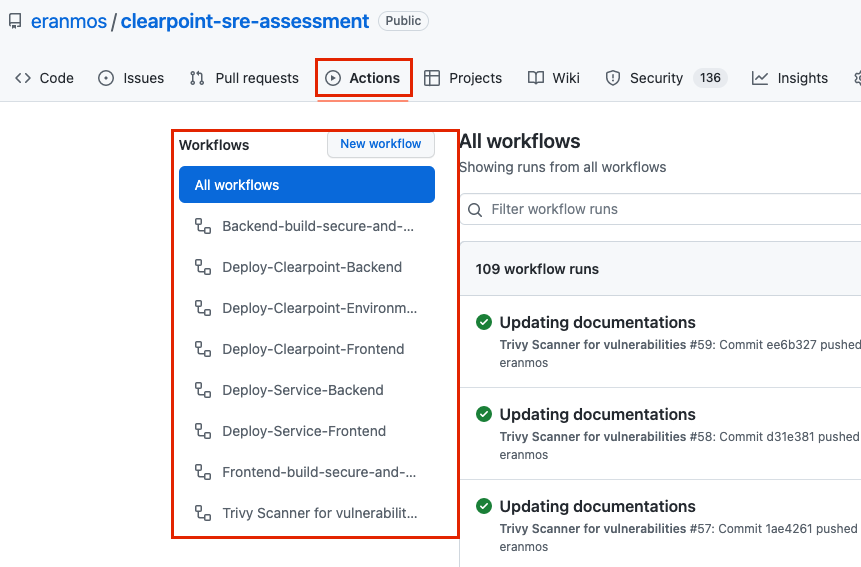
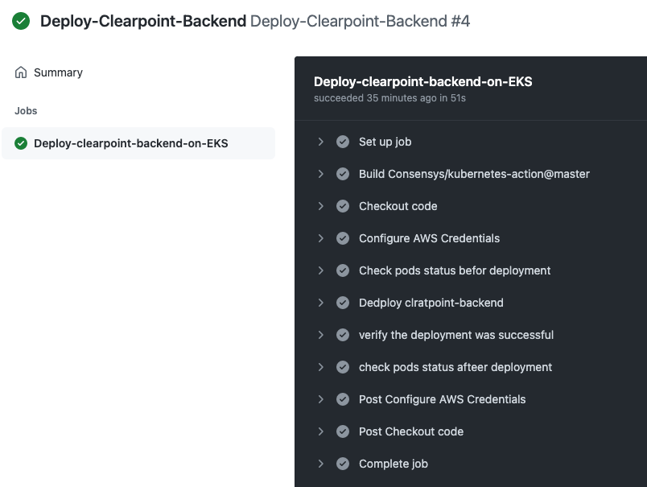
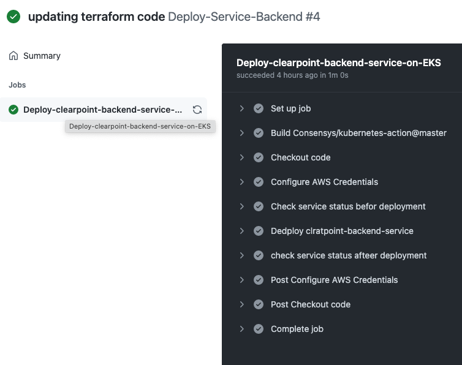
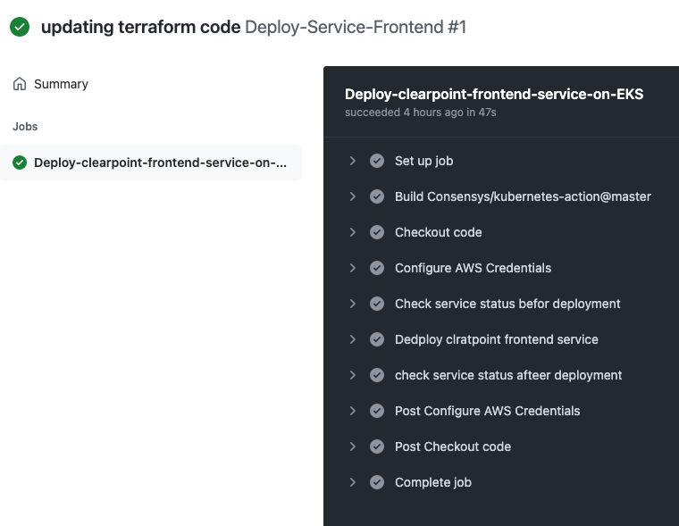
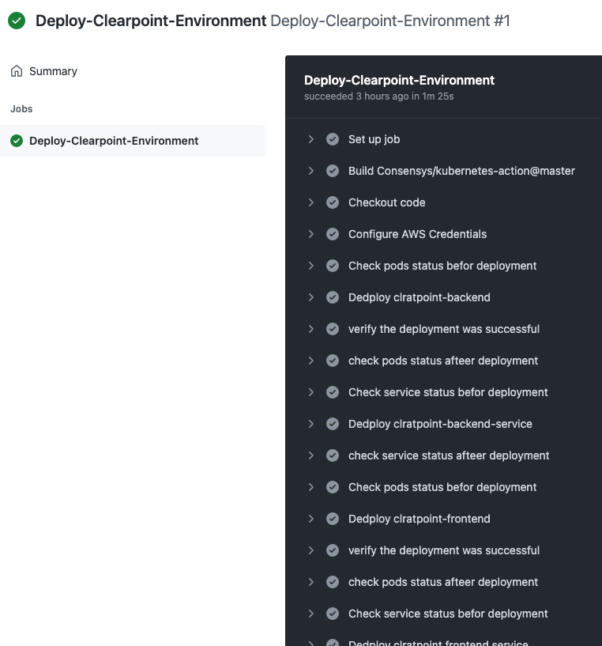

<h1 align="center">GitHub Actions</h1>
<h6 align="center">This README will describe all GitHub Actions< workflows on My Project</h6>

## Application diagram

Actions Link : https://github.com/eranmos/clearpoint-sre-assessment/actions

## Table of Contents

- [GitHub Actions Backend Deployment](#GitHub-Actions-Backend-Deployment)
- [GitHub Actions Frontend Deployment](#GitHub Actions Frontend-Deployment)
- [GitHub Actions BE Service Deployment](#GitHub Actions BE Service Deployment)
- [GitHub Actions FE service Deployment](#GitHub-Actions-FE-service-Deployment)
- [GitHub Actions EKS Deployment](#GitHub-Actions-EKS-Deployment)

##  GitHub Actions Backend Deployment

## GitHub Actions Frontend Deployment

## GitHub Actions BE Service Deployment

## GitHub Actions FE service Deployment

## GitHub Actions EKS Deployment

